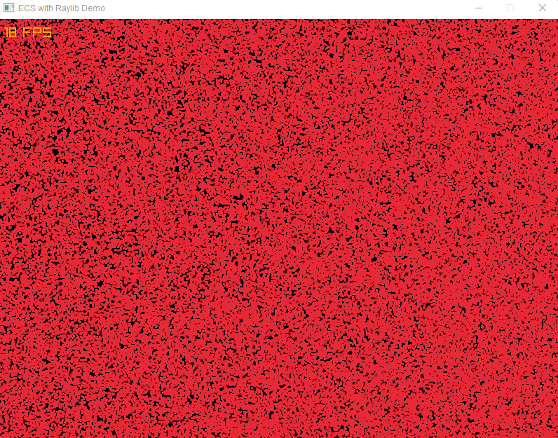

# ECS with Raylib Renderer

**A basic ECS benchmark using Raylib for rendering.**

## Start benchmark 

    go run main.go

Settings in [main.go](https://github.com/andygeiss/ecs-example/tree/main/main.go):
- 200.000 Entities
- Resolution: 1366 x 768

Result on my `i7-10510U with Intel GPU` ;-)

